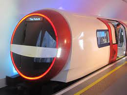

# EmilR-Profile-Dec2022

## Description: 

This webpage contains my portfolio which includes my recent photo, companies I've worked with and projects that I completed. This page includes navigation links that will map and scroll you to the page described in the link. If your scroll through each images on "My Work" section, each photo will enlarge to verify your selection.   If you click on "Contact" the page will scroll to the footer section.  The footer section provides you link to email me, visit my Github and LinkedIn page. My webpage is easily accessible and can be viewed either on your mobile phone, laptop or desktop clearly at any given time.

## Setting up the HTML and the variables 

Below is the CSS Style font styles and colors I used.

    
    
Here is the basic html

       <head>
        <meta charset="utf-8">
        <meta name="Emil Ronquillo Portfolio" content="">
        <meta name="viewport" content="width=device-width, initial-scale=1">
        <link rel="stylesheet" href="./assets/css/reset.css">
        <link rel="stylesheet" href="./assets/css/style.css">
       </head>
      

## Set up the Semantics for the header and the CSS Style.

        <header>

            

               
               <h1> Emil Ronquillo</h1>

            

        </header>
        
        
Here is the CSS Styling:

           header{

            height: 160px;
            width: 100%;
            background-color: rgb(121, 178, 228);

            }

Header CSS Styles -  to align elements in the center and a limit of 1000px.

    .my-header {
    
    //border: 1px solid red;
    padding: 20px;
    height: 160px;
    display: flex;
    align-items: baseline;
    max-width: 1000px;
    margin-left: auto;
    margin-right: auto;

    }
    
Navigation, contains links to scroll to the page targetting the desired location using the id class.

            

              <ul>
                <a href= "#aboutme" > About me</a>
                <a href="#mywork"  > My Work</a> 
                <a href="#contactme"> Contact </a>
             </ul>
             

        </nav>

            
 
            <section class="section-container"> 
            .
            .
            .
            

            <section class="section-container"> 

                

                    <h2>  My Work </h2>
                    
Class "mywork:, include photos for each class and a Javascript.  CSS file is created to properly distribute the images and when you scroll to the image, the image will enlarge. 

                

                    

                        <a href="javascript:alert('Javascript Placeholder');"> 
                            

                                <h4>Golden State</h4>
                                
Javascript here

                            

                    

                    

                        <a href="javascript:alert('Javascript Placeholder');"> 
                            

                                <h4>Dream Car<</h4>
                                
Javascript here

                            
                  
                        

             
                    

                        <a href="javascript:alert('Javascript Placeholder');">
                            

                                <h4>Clock</h4>
                                
Javascript here

                            

                        

                    
                    

                        <a href="javascript:alert('Javascript Placeholder');">
                            

                                <h4>Future Train</h4>
                                
Javascript here

                            

                        

               
                    

                        <a href="javascript:alert('Javascript Placeholder');">
                        

                            <h4>My City</h4>
                            
Javascript

                        

                    
   
            
The CSS Style below for the first image maintains the image width.

                    .surfreport{

                    width: 750px;
                    height: auto;
                    position: relative;

                    }
                    
 The CSS Styke below will allow us to move the images when window screen is decreased
 

                   .ledwall, .calculator, .runbuddy, .pastelpuzzle{

                      width: 350px;
                      height: auto;
                      position: relative;

                  }
            
Footer - each list includes href directing you to my links on how to contact me.

                  

                      <ul>
                           <a href="mailto:emilronquillo@gmail.com"> Contact Me        </a>
                           <a href="https://github.com/Emil1577"  > Portfolio     </a> 
                           <a href=" https://www.linkedin.com/in/emil-ronquillo-76832a32/" > Resume </a>
                       </ul>
                  

Here is the footer CSS maintaining the footer in center even when screen size is adjusted.

                  footer {
                      background-color: var(--bluebackground-color);
                      font-size: 200%;
                      width: 100%;
                      font-size: 150%;
                      height: 150px;
                      position: relative
                  }

## Making this webpage viewable through different screen sies including smartphones.

Created a CSS style media screen. The text and images will automatically adjust depending on the browser window.

     @media screen and (max-width: 1016px) {

                .section1 {

                    border-right: 0;
                    width:100%;
                    display: flex;
                    justify-content: center;
                    align-items:flex-end;
                }
                .aboutme {

                    width: 100%;
                }

                h1 {

                    font-size: 220%;
                }

                .mywork {

                    position: relative;
                    width: 100%;
                }

                .ledwall, .calculator, .runbuddy, .pastelpuzzle{

                    margin: 0 auto;

                }

                .section-container {

                    //border: 3px solid rgb(47, 0, 255);
                    padding: 20px 0 0;

                }

                .surfreport{

                    width: 100%;
                    height: auto;
                }

## Thank you

I hope you enjoy viewing my Portfolio webpage.  Feel free to reach out.

